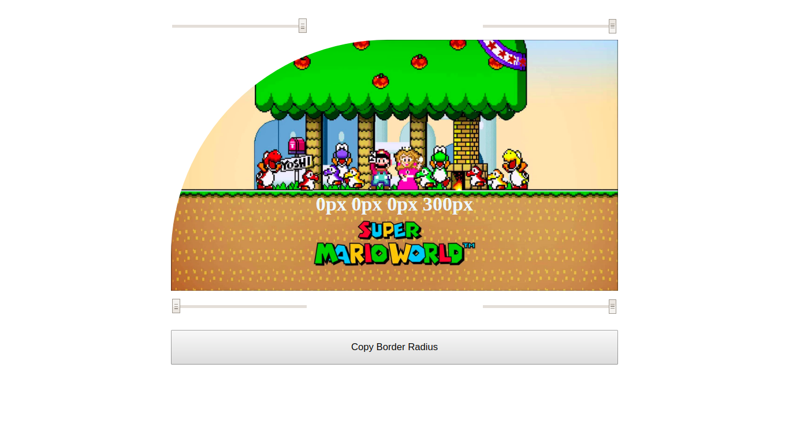
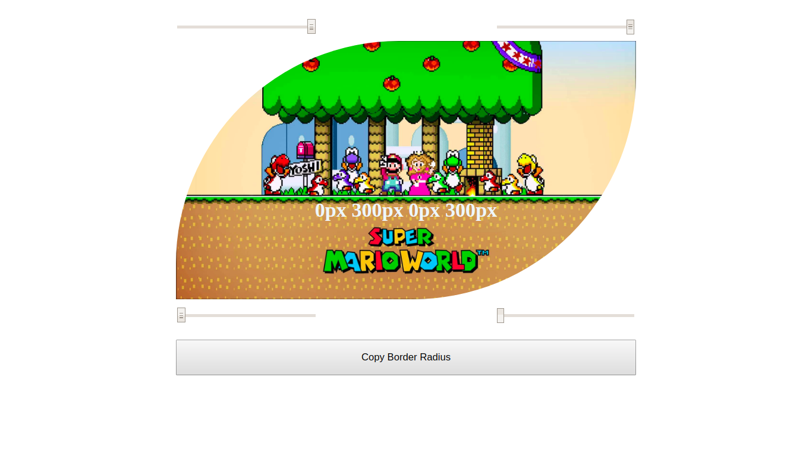
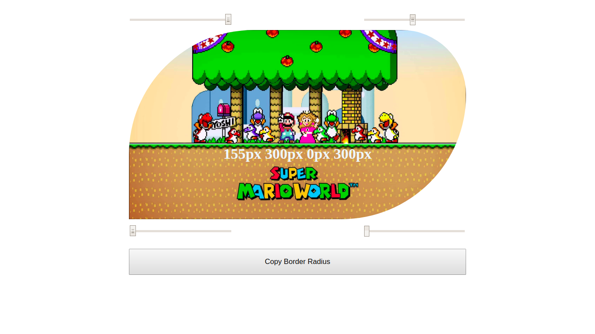
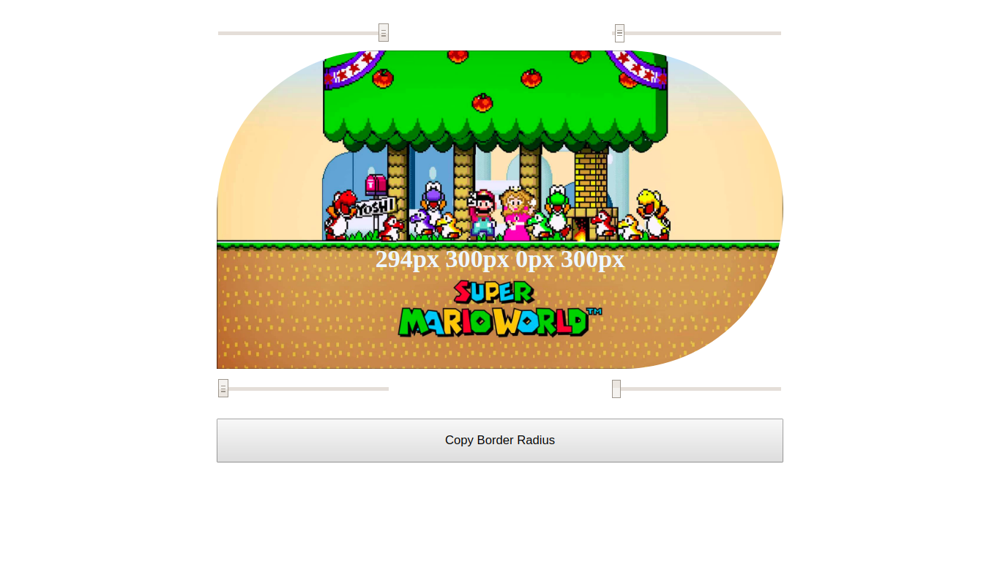
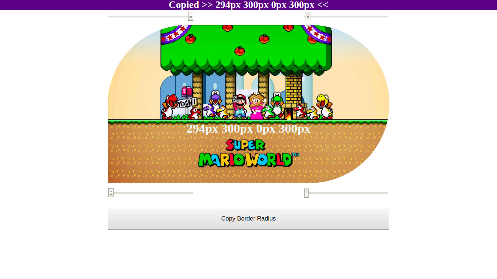
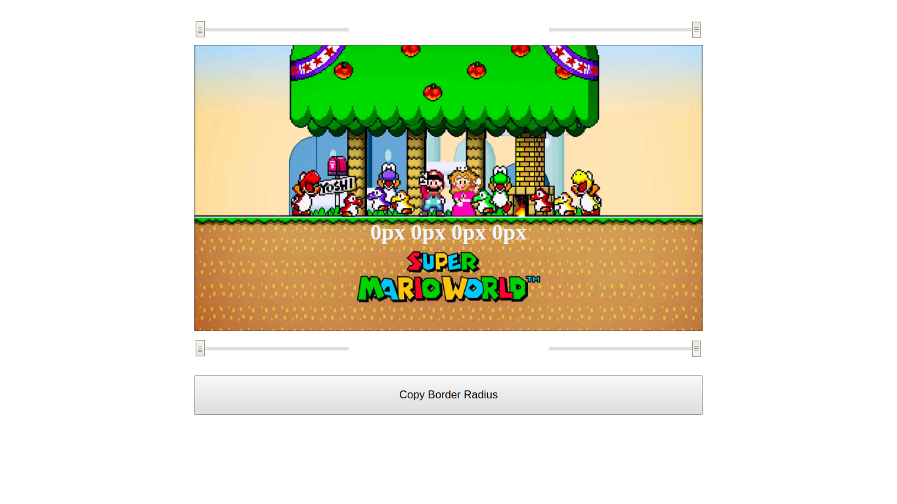
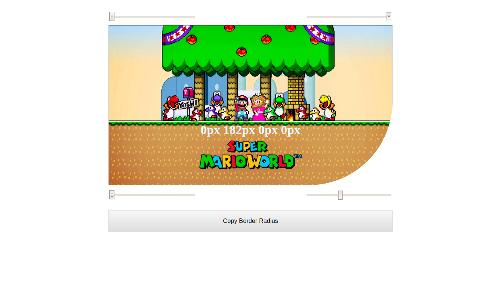
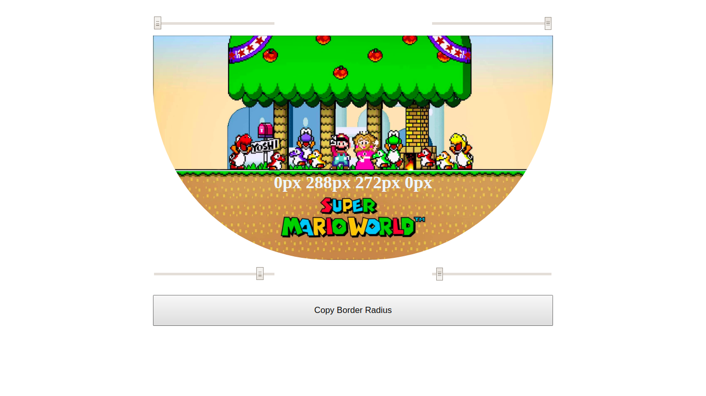
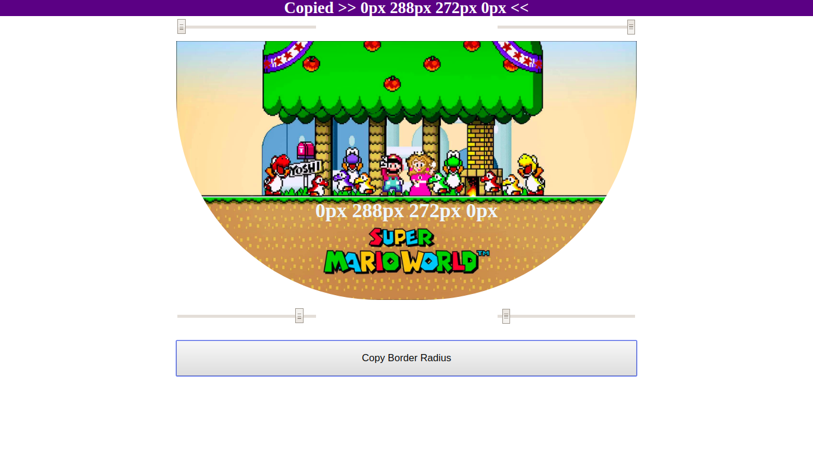

A React App for preview how CSS3 border-radius values affect an element.

 # Border Radius Previous

## Why

This project was created for my personal portifolio, so if you could let me any feedback I'd appreciate so much. Any comment that can make me a better programmer will be help a lot!

And for sure, you can use this Project as you wish!

It's free!

## Contact info

My [LinkedIn](https://www.linkedin.com/in/brunomoura1/)

My email bruno8moura@gmail.com

