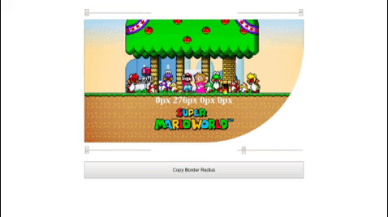

A React App for preview how CSS3 border-radius values affect an element.

 # Border Radius Previous




## Why

This project was created for my personal portifolio, so if you could let me any feedback I'd appreciate so much. Any comment that can make me a better programmer will be help a lot!

And for sure, you can use this Project as you wish!

It's free!

## Contact info

My [LinkedIn](https://www.linkedin.com/in/brunomoura1/)

My email bruno8moura@gmail.com

My [Medium.com](https://medium.com/@bruno8moura) space

## Getting started

### Prerequisites

Just only the basic enviroment of React.

### Installing

```
$ git clone git@github.com:brunocmoura/border-radius-previous.git
$ cd border-radius-prevous
$ npm install
```

### Running application

```
$ npm start
```

## Build with

 - [React](https://reactjs.org/) - Library that facilitate the creation of user interfaces.
 - [ReactDOM]() - Library that acts an intermediary between React and DOM API( i.e. It's the entry point for React library).
 - [Materialize-css](https://materializecss.com/) - A responsive frontend framework based on Material Design.
 - [react-scripts](https://www.npmjs.com/package/react-scripts) - Package utilized by tool [create-react-app](https://github.com/facebook/create-react-app)
